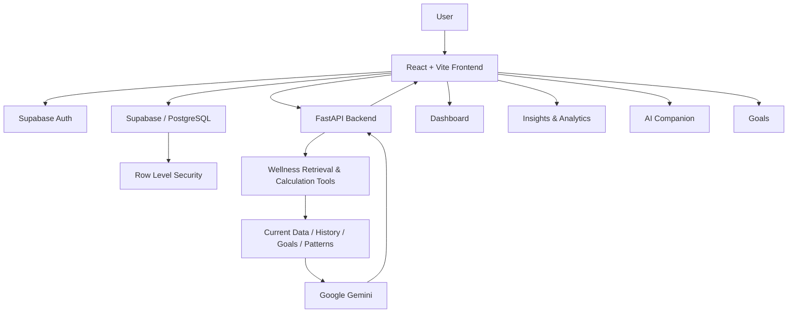

# WellSync

> **Your Personal Wellness Command Center**\
> **Track less. Understand more. Act better.**

[](LICENSE)
[](https://react.dev/)
[](https://fastapi.tiangolo.com/)
[](https://ai.google.dev/)
[](https://supabase.com/)

**Live Demo:** https://wellsync-eight.vercel.app/\
**Repository:** https://github.com/Kaushik-Raj10/WELLSYNC

------------------------------------------------------------------------

## 🧠 What is WELLsync?

Modern wellness data is fragmented. Sleep lives in one place, activity
in another, screen time somewhere else, while mood, stress and energy
are often never recorded.

**WELLsync brings these signals together into one intelligent wellness
command center.**

It tracks:

**😴 Sleep · 💧 Hydration · 🚶 Activity · 🖥️ Screen Time · 😊 Mood · ⚡
Energy · 🧠 Stress**

Then it goes beyond tracking:

> **DATA → PATTERNS → INSIGHTS → AI EXPLANATION → ACTION**

WELLsync uses historical wellness data to surface personal patterns and
lets users hand that context directly to an AI wellness companion for
practical, personalized guidance.

### 🎯 The core idea

> **WELLsync doesn't just tell you what happened today. It helps you
> understand your habits and decide what to improve next.**

------------------------------------------------------------------------

# ✨ Why WELLsync?

  Traditional Tracker          WELLsync
  ---------------------------- ---------------------------------------
  Shows isolated metrics       Connects multiple wellness signals
  Focuses on logging           Focuses on understanding
  Static charts                Historical trends + personal patterns
  Generic advice               Context-aware AI guidance
  Data stays fragmented        One unified wellness command center
  User interprets everything   AI helps explain the data

------------------------------------------------------------------------

# 🚀 Core Features

## 🤖 1. AI Wellness Companion --- The Intelligence Layer

WELLsync integrates **Google Gemini** as its AI intelligence layer.

The backend can provide the AI with relevant wellness context such as:

-   Current wellness data
-   Goal gaps
-   Historical summaries
-   Personal patterns
-   Training context
-   Nutrition context

The backend performs factual retrieval and calculations, while Gemini
focuses on interpretation and communication.

### Example

A user asks:

> **"Why has my energy been low recently?"**

Instead of answering from generic wellness advice, WELLsync can use the
user's available wellness context to explain relevant patterns and
suggest practical next steps.

**Key principle:**

> **Retrieve facts first → interpret with AI → communicate an actionable
> response.**

The AI is designed for general wellness guidance and is **not a medical
diagnosis or treatment system**.

------------------------------------------------------------------------

## 🔎 2. Personal Pattern Detection

WELLsync looks beyond individual entries to identify meaningful patterns
across the user's wellness history.

Examples of the type of insight the system is designed to surface:

-   Relationships between sleep and energy
-   Changes in stress over time
-   Activity and mood trends
-   Goal gaps
-   Longer-term wellness signals

This turns raw logs into **personalized context**.

------------------------------------------------------------------------

## 📊 3. Unified Wellness Dashboard

The dashboard acts as the user's central command center.

It brings together:

-   Wellness score
-   Today's signals
-   AI wellness brief
-   Trends
-   Goals
-   Progress
-   Time-aware visual experience

The goal is to make the user's current wellness state understandable at
a glance.

------------------------------------------------------------------------

## 📝 4. Daily Check-In

A structured daily check-in captures:

-   😴 Sleep
-   💧 Hydration
-   🚶 Activity / steps
-   🖥️ Screen time
-   😊 Mood
-   ⚡ Energy
-   🧠 Stress

This creates the personal history used by the analytics and AI layers.

------------------------------------------------------------------------

## 📈 5. Insights

The Insights section turns wellness history into understandable signals:

-   Personal patterns
-   Strengths
-   Opportunities
-   Longer-term wellness trends

The important UX flow is:

**Insight → AI Companion → Explanation → Practical Action**

------------------------------------------------------------------------

## 📉 6. Analytics & Historical Trends

Users can explore their wellness history through visual analytics and
trends.

Powered by **Recharts**, the analytics layer helps users move from a
single daily measurement to a broader understanding of their habits.

------------------------------------------------------------------------

## 🎯 7. Personal Goals

Users can define targets around:

-   Sleep
-   Water / hydration
-   Steps
-   Screen time

Goal progress can also become context for the AI companion.

------------------------------------------------------------------------

## 🧮 8. Transparent Wellness Score

WELLsync provides a single product-level wellness signal based on
weighted inputs:

  Signal             Weight
  ---------------- --------
  😴 Sleep              20%
  🚶 Activity           20%
  💧 Hydration          15%
  😊 Mood               15%
  🖥️ Screen time        10%
  ⚡ Energy             10%
  🧠 Stress             10%

> **Important:** This score is a transparent prototype heuristic, not a
> medically validated measurement.

------------------------------------------------------------------------

## ☁️ 9. Cloud Synchronization & Secure Data Access

WELLsync supports:

-   Local browser storage as a fallback
-   Supabase cloud synchronization for authenticated users
-   Daily check-in synchronization
-   Goal synchronization
-   Supabase Row Level Security (RLS)

This gives the application a practical path from local prototype usage
to authenticated cloud-based personalization.

------------------------------------------------------------------------

## 📱 10. Responsive Experience

WELLsync is designed for:

-   Desktop
-   Tablet
-   Mobile

The responsive shell includes mobile navigation, touch-friendly
controls, safe-area handling and dynamic viewport sizing.

------------------------------------------------------------------------

## 🌅 11. Time-Aware Dashboard Experience

The dashboard adapts its scenic background and music to the user's local time:

  Local Time       Scene
  ---------------- ------------
  05:00 -- 11:59   🌅 Morning
  12:00 -- 16:59   ☀️ Day
  17:00 -- 20:59   🌇 Evening
  21:00 -- 04:59   🌙 Night

This is a UX detail rather than a wellness calculation, but it makes the
dashboard feel more contextual and alive.
Music change according to background (autoplay)


------------------------------------------------------------------------

# 🔄 End-to-End Product Flow

``` text
                    ┌───────────────────────┐
                    │      USER INPUT       │
                    │ Sleep / Water / Steps │
                    │ Screen / Mood / etc.  │
                    └───────────┬───────────┘
                                │
                                ▼
                    ┌───────────────────────┐
                    │    DATA LAYER         │
                    │ Local Storage /       │
                    │ Supabase + PostgreSQL │
                    └───────────┬───────────┘
                                │
                                ▼
                    ┌───────────────────────┐
                    │ ANALYTICS & PATTERNS  │
                    │ Trends / Goal Gaps /  │
                    │ Personal Signals      │
                    └───────────┬───────────┘
                                │
                    ┌───────────┴───────────┐
                    │                       │
                    ▼                       ▼
          ┌─────────────────┐     ┌──────────────────┐
          │  DASHBOARD      │     │  AI COMPANION    │
          │  Score / Trends │     │  Google Gemini   │
          │  Goals / Brief  │     │  Context-aware   │
          └────────┬────────┘     └────────┬─────────┘
                   │                       │
                   └───────────┬───────────┘
                               ▼
                    ┌───────────────────────┐
                    │ ACTIONABLE GUIDANCE   │
                    │ Understand → Act →    │
                    │ Track → Improve       │
                    └───────────────────────┘
```

------------------------------------------------------------------------

# 🏗️ System Architecture



### Architecture principles

1.  **Frontend handles experience and visualization.**
2.  **Supabase handles authentication and persistent wellness data.**
3.  **FastAPI provides the backend/API layer.**
4.  **Backend tools retrieve and calculate factual wellness context.**
5.  **Gemini interprets that context and communicates it
    conversationally.**
6.  **RLS protects authenticated cloud data at the database layer.**

------------------------------------------------------------------------

# 🛠️ Technology Stack

### Frontend

-   React
-   Vite
-   JavaScript / JSX
-   CSS
-   Recharts
-   Supabase Auth

### Backend

-   Python
-   FastAPI
-   Google Gemini
-   Google GenAI SDK

### Data & Authentication

-   Supabase
-   PostgreSQL
-   Row Level Security (RLS)

### Deployment

-   Vercel --- frontend
-   Render --- backend
-   GitHub --- source control

------------------------------------------------------------------------

# 📁 Project Structure

``` text
WELLSYNC/
├── public/
│   └── wellsync-scenes/
│       ├── morning.jpg
│       ├── day.jpg
│       ├── evening.jpg
│       └── night.jpg
│
├── src/
│   ├── components/
│   ├── lib/
│   └── utils/
│
├── backend/
├── .env.example
├── .gitignore
├── package.json
├── vite.config.js
├── index.html
├── INTEGRATION.md
├── AGE_SYSTEM_INTEGRATION.md
├── LICENSE
└── README.md
```

------------------------------------------------------------------------

# ⚙️ Installation & Configuration

## Prerequisites

  Requirement   Recommended
  ------------- ------------------------------------------
  Node.js       **20.x or newer**
  Python        **3.11 or newer**
  npm           Compatible with Node.js 20+
  GPU           Not required for the current application
  Browser       Modern Chromium, Firefox, Safari or Edge

> The ASYNC'26 technical guidelines specify Python ≥ 3.11 and Node ≥
> 20.x as repository prerequisites.

------------------------------------------------------------------------

## 1. Clone

``` bash
git clone https://github.com/Kaushik-Raj10/WELLSYNC.git
cd WELLSYNC
```

## 2. Install frontend dependencies

``` bash
npm install
```

## 3. Configure frontend environment

Create `.env.local`:

``` env
VITE_SUPABASE_URL=https://YOUR_PROJECT_ID.supabase.co
VITE_SUPABASE_PUBLISHABLE_KEY=YOUR_SUPABASE_PUBLISHABLE_KEY
VITE_API_URL=http://127.0.0.1:8000
```

Never commit real credentials.

## 4. Start the frontend

### Windows

``` bash
npm.cmd run dev
```

### Other platforms

``` bash
npm run dev
```

Frontend:

``` text
http://localhost:5173/
```

------------------------------------------------------------------------

# 🐍 Backend Setup

From the project root:

``` bash
cd backend
```

Create and activate a Python virtual environment:

``` bash
python -m venv .venv
```

### Windows

``` bash
.\.venv\Scripts\activate
```

Install the backend dependencies according to the backend dependency
file included in the repository.

Then configure the backend environment variables and start FastAPI:

``` bash
.\.venv\Scripts\python.exe -m uvicorn main:app --reload --port 8000
```

Backend:

``` text
http://127.0.0.1:8000
```

When running FastAPI locally, the standard interactive API documentation
is available at:

``` text
http://127.0.0.1:8000/docs
```

------------------------------------------------------------------------

# 🔐 Environment Variables

## Frontend

  ----------------------------------------------------------------------------------------------------------------------
  Variable                          Type           Required       Example / Default                       Purpose
  --------------------------------- -------------- -------------- --------------------------------------- --------------
  `VITE_SUPABASE_URL`               String         Yes            `https://YOUR_PROJECT_ID.supabase.co`   Supabase
                                                                                                          project URL

  `VITE_SUPABASE_PUBLISHABLE_KEY`   String         Yes            `YOUR_SUPABASE_PUBLISHABLE_KEY`         Supabase
                                                                                                          publishable
                                                                                                          client key

  `VITE_API_URL`                    URL            Yes            `http://127.0.0.1:8000`                 FastAPI
                                                                                                          backend URL
  ----------------------------------------------------------------------------------------------------------------------

## Backend

  -------------------------------------------------------------------------------------------------
  Variable                   Type           Required       Example / Default       Purpose
  -------------------------- -------------- -------------- ----------------------- ----------------
  `GEMINI_API_KEY`           Secret string  Yes            `your_gemini_api_key`   Google Gemini
                                                                                   authentication

  `GEMINI_MODEL`             String         Yes            Configured Gemini model Primary Gemini
                                                                                   model

  `GEMINI_FALLBACK_MODELS`   String/list    No             Configured fallback     Optional model
                                                           models                  fallback

  `GEMINI_MAX_RETRIES`       Integer        No             `1`                     Maximum Gemini
                                                                                   retry count
  -------------------------------------------------------------------------------------------------

### 🔒 Secret handling

**Never commit:**

-   API keys
-   `.env`
-   `.env.local`
-   Backend secrets
-   Supabase service-role credentials

Use `.env.example` as the configuration template.

------------------------------------------------------------------------

# 🧪 Developer Experience & Quality Control

## Frontend commands

### Development

``` bash
npm run dev
```

### Production build

``` bash
npm run build
```

### Lint / static analysis

``` bash
npm run lint
```

### Preview production build

``` bash
npm run preview
```

## Backend

Run the API locally:

``` bash
python -m uvicorn main:app --reload --port 8000
```

API documentation:

``` text
http://127.0.0.1:8000/docs
```

> The current repository defines frontend build, lint and preview
> scripts. A dedicated automated unit/integration test suite is not
> currently documented as part of the project.

------------------------------------------------------------------------

# 📊 Reliability, Performance & Maturity

### Current maturity

**Hackathon / Prototype**

WELLsync is currently optimized for demonstrating the complete product
concept and end-to-end architecture.

### Performance reporting

No formal latency, throughput, load-test or benchmark figures are
currently claimed.

This README intentionally avoids fabricated performance numbers.

### Reliability approach

-   Local storage fallback
-   Cloud synchronization for authenticated users
-   Backend separation from frontend
-   Database-level RLS
-   Configurable Gemini model/fallback configuration
-   Retry configuration for Gemini requests

------------------------------------------------------------------------

# 🛡️ Security & Privacy

WELLsync is designed with several basic security principles:

### 🔐 Authentication

Supabase Auth is used for authenticated application access.

### 🗄️ Row Level Security

Cloud wellness data is protected using **Supabase Row Level Security
(RLS)**.

### 🔑 Secrets

Secrets are kept in environment variables and must never be committed to
Git.

### 🤖 AI boundary

The AI layer is intended for **general wellness guidance**, not
diagnosis, treatment or emergency medical decision-making.

### 🚨 Vulnerability reporting

Please do **not** publish sensitive vulnerability details in a public
issue.

For a security report:

1.  Use GitHub's private security-reporting / security-advisory
    mechanism when available.
2.  If private reporting is unavailable, contact the repository
    maintainers through GitHub.
3.  Include reproducible steps, affected component, impact and a safe
    remediation suggestion.
4.  Do not include API keys, user data or other secrets in the report.

------------------------------------------------------------------------

# ⚠️ Troubleshooting & Known Limitations

  -----------------------------------------------------------------------
  Issue                   Likely Cause            Resolution
  ----------------------- ----------------------- -----------------------
  Frontend cannot reach   Backend is not running  Start FastAPI and
  API                     or `VITE_API_URL` is    verify the API URL
                          incorrect               

  Supabase authentication Incorrect Supabase      Verify
  fails                   URL/key                 `VITE_SUPABASE_URL` and
                                                  publishable key

  AI Companion cannot     Missing/invalid Gemini  Verify `GEMINI_API_KEY`
  respond                 configuration           and configured model

  Cloud data does not     Authentication or       Check Supabase project
  sync                    Supabase configuration  configuration and RLS
                          issue                   policies

  Local data works but    User is not             Sign in and verify
  cloud data does not     authenticated           Supabase configuration

  Port already in use     Another process owns    Stop the process or
                          the port                choose another
                                                  development port

  AI response is          Provider/model/API      Check backend logs and
  unavailable             issue                   configured Gemini
                                                  fallback settings
  -----------------------------------------------------------------------

### Known product limitations

-   The wellness score is a **prototype heuristic**, not a medically
    validated metric.
-   AI responses are wellness guidance and should not be treated as
    medical diagnosis or treatment.
-   Formal performance benchmarks are not currently published.
-   A dedicated automated unit/integration test suite is not currently
    documented.

------------------------------------------------------------------------

# 🎥 Demo & Media

### Live Demo

**https://wellsync-eight.vercel.app/**

### Recommended judge demo path

A judge can understand the product without a presenter by following:

``` text
1. Open Dashboard
        ↓
2. Review today's wellness signals
        ↓
3. Open Insights / Analytics
        ↓
4. Observe personal patterns and trends
        ↓
5. Hand context to AI Companion
        ↓
6. Ask a wellness question
        ↓
7. Receive contextual explanation + practical guidance
        ↓
8. Review Goals and progress
```

### Screenshots

For the final submission, place high-resolution screenshots in:

``` text
docs/
└── screenshots/
    ├── dashboard.png
    ├── daily-checkin.png
    ├── insights.png
    ├── analytics.png
    ├── ai-companion.png
    └── goals.png
```

Then add them to this section using standard Markdown image syntax.

### Demo video

Add the final 2--3 minute ASYNC'26 demo video link here:

``` text
[Watch the WELLsync Demo](YOUR_DEMO_VIDEO_URL)
```

------------------------------------------------------------------------

# 🧭 Product Philosophy

WELLsync is built around a simple progression:

``` text
TRACK
  ↓
Understand what is happening
  ↓
ANALYZE
  ↓
Discover personal patterns
  ↓
EXPLAIN
  ↓
Use AI to understand the context
  ↓
ACT
  ↓
Turn insight into a practical next step
  ↓
IMPROVE
  ↓
Track again and observe change
```

> **From fragmented wellness data to personalized action.**

------------------------------------------------------------------------

# 🔮 Future Roadmap

Potential next steps include:

-   Automated wearable integrations
-   More passive data collection
-   Expanded pattern detection
-   More advanced personalization
-   Richer goal recommendations
-   More comprehensive automated testing
-   Performance/load benchmarking
-   Expanded security and observability
-   More integrations for long-term wellness data

------------------------------------------------------------------------

# 🤝 Contributing

Contributions are welcome.

1.  Fork the repository.
2.  Create a feature branch.

``` bash
git checkout -b feature/your-feature
```

3.  Make your changes.
4.  Run the available quality checks:

``` bash
npm run lint
npm run build
```

5.  Commit with a clear message.

``` bash
git commit -m "feat: add your feature"
```

6.  Push the branch.

``` bash
git push origin feature/your-feature
```

7.  Open a Pull Request.

### Contribution guidelines

-   Keep changes focused.
-   Follow the existing project structure.
-   Do not commit secrets.
-   Update documentation when behavior changes.
-   Preserve the wellness/medical disclaimer.
-   Test the affected functionality locally before opening a PR.

------------------------------------------------------------------------

# 📄 License

WELLsync is licensed under the **MIT License**.

See the [`LICENSE`](LICENSE) file for the complete license text.

The MIT License permits use, modification, distribution and
private/commercial use subject to the conditions of the license.

------------------------------------------------------------------------

# 🛡️ Wellness Disclaimer

WELLsync is a wellness and lifestyle application intended to help users
understand everyday habits and build sustainable routines.

**It does not provide medical diagnosis, prescribe medication, or
replace professional medical advice.**

------------------------------------------------------------------------

# 👥 Project

**WELLsync --- AI + Lifestyle + Data + Personalization + Modern UX**

Built for **ASYNC'26**.

------------------------------------------------------------------------

## ⭐ The one-line takeaway

> **WELLsync turns everyday wellness data into personal understanding
> --- then uses AI to turn that understanding into action.**
